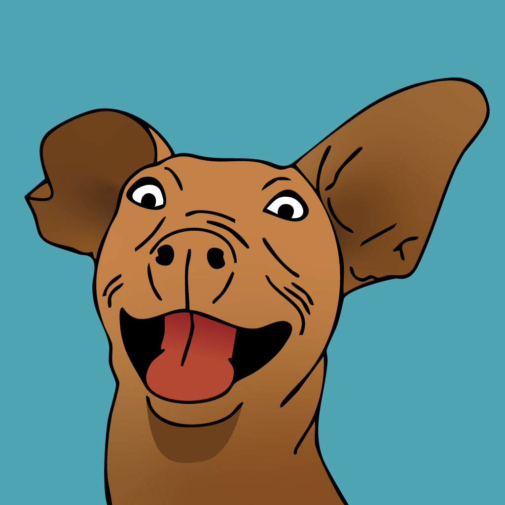
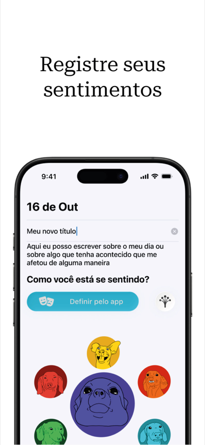
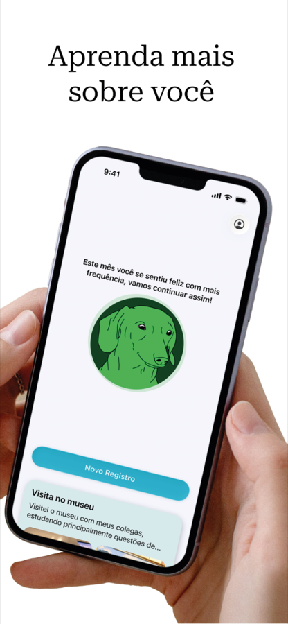
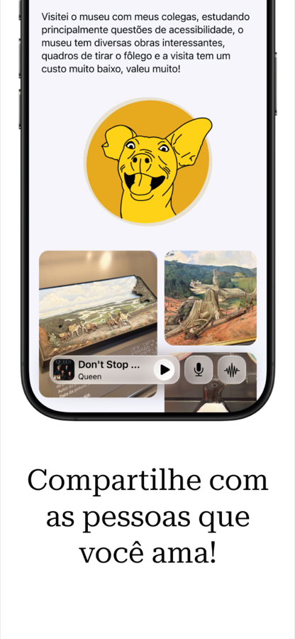
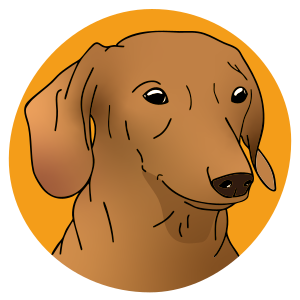
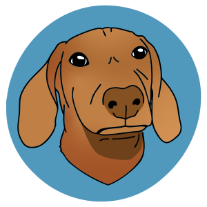
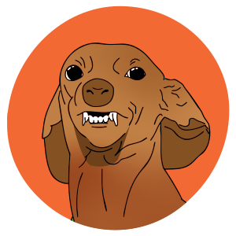
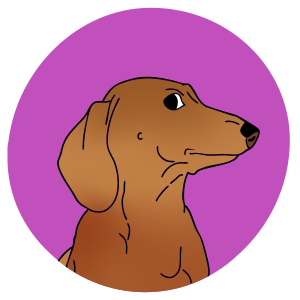
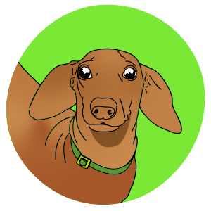
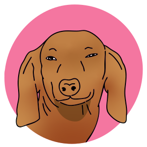

<div align="center">



# NotADiary

### An emotional journal for iOS that goes beyond words. 🐾

Capture how you feel with text, photos, music, and **haptic feedback** that turns
every emotion into a physical sensation — guided by a little dachshund mascot that
mirrors your mood.

<br/>

[](https://www.apple.com/ios/)
[](https://swift.org)
[](https://developer.apple.com/xcode/swiftui/)
[](https://developer.apple.com/icloud/cloudkit/)
[](LICENSE)

<br/>

<a href="https://apps.apple.com/br/app/notadiary/id6753695305">
  
</a>

</div>

---

## 📑 Table of Contents

- [About](#-about)
- [Screenshots](#-screenshots)
- [Meet the Mascot](#-meet-the-mascot)
- [Features](#-features)
- [Tech Stack](#-tech-stack)
- [Requirements](#-requirements)
- [Project Structure](#-project-structure)
- [Getting Started](#-getting-started)
- [Team](#-team)
- [License](#-license)

---

## ✨ About

**NotADiary** ("not a diary") is a journaling app focused on emotional check-ins.
The idea is simple: instead of just writing, you tie each entry to an **emotion**, a
**song**, and **photos** — and the device itself *responds* to that emotion through
vibration patterns (haptics) carefully designed for each feeling.

A mascot follows along with every entry, shifting its mood to match the emotion you
log — giving your journal real personality.

---

## 📱 Screenshots

<div align="center">

| Log your feelings | Learn about yourself | Share what you love |
|:---:|:---:|:---:|
|  |  |  |

</div>

---

## 🐶 Meet the Mascot

The dachshund reacts to your entry with **12 mood states** (six base emotions, each
with an *ultra* variant). Here are the six core moods:

<div align="center">

| Happiness | Sadness | Anger |
|:---:|:---:|:---:|
|  |  |  |
| **Fear** | **Surprise** | **Love** |
|  |  |  |

</div>

---

## 🚀 Features

- **📝 Journal entries** — title, text, date and the emotion of the moment.
- **😊 Emotional mascot** — a character that mirrors the entry's mood, with 12 states (happiness, anger, surprise, fear, love, sadness, and their intense variants).
- **📳 Emotional haptics** — unique vibration patterns built with **Core Haptics** for each emotion (e.g. a "heartbeat" for love, a "tremor" for fear, an "explosion" for anger).
- **🎵 Apple Music integration** — search and attach a song to each entry via **MusicKit**, with in-app playback and **Music Haptics** support.
- **📷 Photos** — attach images to your entries in a visual gallery.
- **☁️ iCloud sync** — all entries and preferences are stored and synced with **CloudKit**.
- **🔔 Reminders** — schedule notifications to remember to log your day.
- **📤 Shareable cards** — export and share entries as a custom `.card` document type.
- **👋 Onboarding** — a welcome flow with name setup and notification configuration.

---

## 🛠️ Tech Stack

| Area | Technology |
|------|-----------|
| UI | SwiftUI |
| Persistence / Sync | CloudKit (iCloud) |
| Music | MusicKit · MediaPlayer · AVFoundation |
| Haptics | Core Haptics · MediaAccessibility (Music Haptics) |
| Notifications | UserNotifications |
| Architecture | MVVM |

> There is also exploratory work integrating **HealthKit (State of Mind)** to log mood in the Health app.

---

## 📋 Requirements

- **iOS 26.0** or later
- Xcode 26 or later
- An iCloud account (for sync)
- An Apple Music subscription (for the music features)

---

## 📂 Project Structure

```
NotADiary/
├── NotADiaryApp.swift          # Entry point
├── Models/
│   ├── JournalModels/          # JournalEntry, Entry, Mascot, Image
│   ├── ShareModels/            # Card (Transferable / UTType)
│   ├── MusicKitModels/         # Music Haptics
│   ├── HealthKitModels/        # State of Mind (exploratory)
│   ├── EmotionHapticEngine.swift  # Per-emotion vibration patterns
│   ├── NotificationsModel.swift
│   └── PreferenceModel.swift
├── ViewModels/
│   ├── CloudKitVM/             # Entry & preference sync
│   ├── MusicKitVM/             # Music player and search
│   ├── JournalVM/              # Mascot logic
│   ├── ShareVM/                # Card generation & conversion
│   └── HealthKitVM/
├── Views/
│   ├── OnboardingViews/        # Name & notification setup flow
│   ├── JournalViews/           # List, create, edit and view entries
│   ├── ShareViews/             # Shareable card
│   └── Components/             # Reusable components (mascot, music, photos…)
├── Extensions/
└── Assets/                     # Colors, mascots (SVG) and icons
```

The architecture follows the **MVVM** pattern, cleanly separating data models,
presentation logic (ViewModels with `@Observable`/`ObservableObject`) and the
SwiftUI views.

---

## 🎯 Getting Started

**Requirements:** Xcode 26+, an iCloud account, and an Apple Music subscription for music features.

```bash
# Clone the repository
git clone https://github.com/EnzoFerroni/NotADiary.git
cd NotADiary

# Open the project in Xcode
open NotADiary.xcodeproj
```

Pick a simulator or device and run with **⌘R**. (CloudKit, MusicKit and Haptics work best on a real device.)

---

## 👥 Team

<div align="center">
  <table>
    <tr>
      <td align="center" width="20%">
        <a href="https://github.com/EnzoFerroni"></a>
        <br/><sub><b>Enzo Ferroni</b></sub><br/><br/>
        <a href="https://github.com/EnzoFerroni"></a>
        <a href="https://www.linkedin.com/in/enzoferroni/"></a>
      </td>
      <td align="center" width="20%">
        <a href="https://github.com/LosadaT"></a>
        <br/><sub><b>Francisco Losada</b></sub><br/><br/>
        <a href="https://github.com/LosadaT"></a>
        <a href="https://www.linkedin.com/in/francisco-losada-totaro/"></a>
      </td>
      <td align="center" width="20%">
        <a href="https://github.com/gsgonca"></a>
        <br/><sub><b>Gabriel Gonçalves</b></sub><br/><br/>
        <a href="https://github.com/gsgonca"></a>
        <a href="https://www.linkedin.com/in/gabriel-s-gon%C3%A7alves/"></a>
      </td>
      <td align="center" width="20%">
        <a href="https://github.com/PedroTessaro"></a>
        <br/><sub><b>Pedro Tessaro</b></sub><br/><br/>
        <a href="https://github.com/PedroTessaro"></a>
        <a href="https://www.linkedin.com/in/pedrotessaro/"></a>
      </td>
      <td align="center" width="20%">
        <a href="https://github.com/hyauss"></a>
        <br/><sub><b>Vinicius Marques</b></sub><br/><br/>
        <a href="https://github.com/hyauss"></a>
        <a href="https://www.linkedin.com/in/vinicius-marques-966918274/"></a>
      </td>
    </tr>
  </table>
</div>

---

## 📄 License

Released under the [MIT License](LICENSE). © 2026 Enzo Ferroni, Francisco Losada, Gabriel Gonçalves, Pedro Tessaro and Vinicius Marques.

<div align="center">
<br/>
<sub>Made with 💜, haptics and a very expressive dachshund.</sub>
</div>
